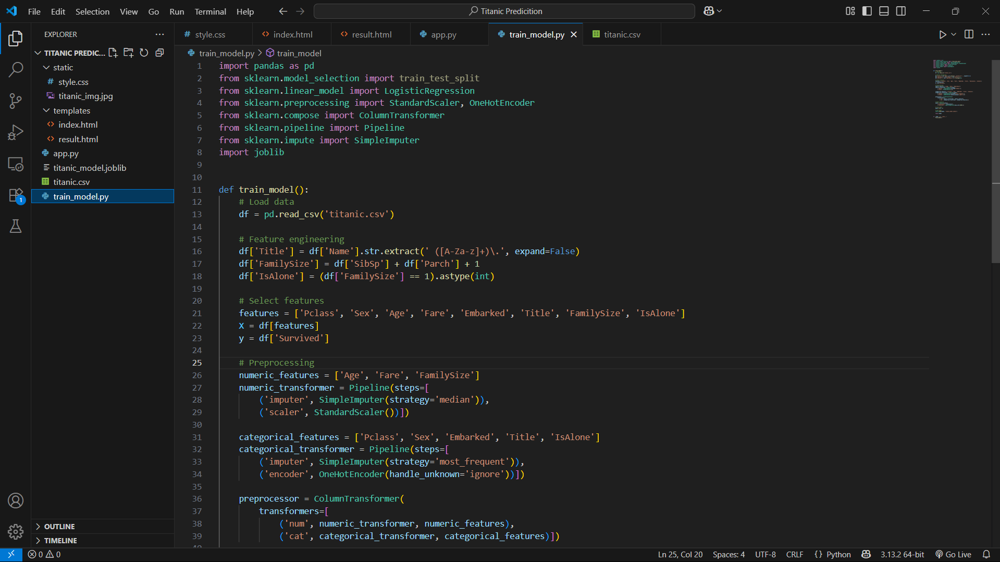
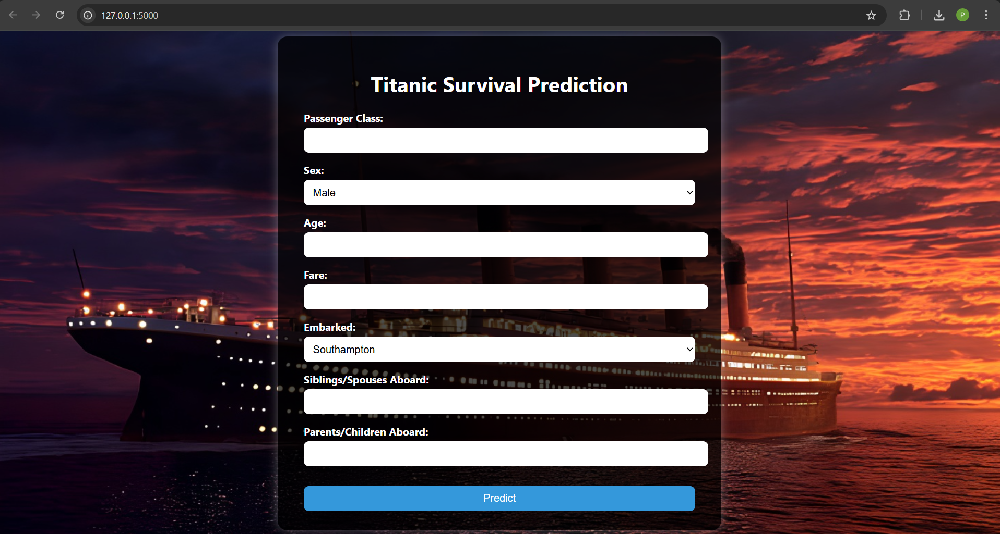

# 🚢 Titanic Survival Prediction Web App


## 📌 Project Overview

This project is a responsive web-based **Titanic Survival Predictor**, built using **Machine Learning** and **Flask**.

It was developed as **Task 3 of my internship at Afido Tech**, with the goal of learning how to preprocess real-world data, build an end-to-end ML model, and deploy it through a user-friendly web interface.

The app predicts whether a passenger would have **survived the Titanic disaster** based on the following inputs:

- Passenger Class (Pclass)
- Gender
- Age
- Fare
- Port of Embarkation
- Number of Siblings/Spouses Aboard
- Number of Parents/Children Aboard

---

## 🎯 Key Highlights

- ✅ Model: `LogisticRegression` from `scikit-learn`
- ✅ Dataset: Titanic dataset from [Kaggle](https://www.kaggle.com/c/titanic/data)
- ✅ Accuracy: Achieved ~80% on test set using feature engineering
- ✅ Feature Engineering: Title extraction, family size, isolation flag
- ✅ Tech Stack: Python, Flask, HTML/CSS, Bootstrap
- ✅ UI/UX: Custom Titanic-themed background, styled form

---

## 🔍 Learning Outcomes

During this project, I explored:
- Data cleaning, imputation, and transformation
- Categorical encoding and numeric scaling via pipelines
- Building robust ML pipelines using `ColumnTransformer`
- Flask integration with ML predictions
- Styling using Bootstrap and fixed backgrounds
- Git & GitHub version control

---

## 🖼 Screenshots

  


## 🛠 How to Run Locally

### 🔹 Install dependencies
```bash
pip install -r requirements.txt
```

### 🔹 Train the model
```bash
python train_model.py
```

### 🔹 Start the Flask server
```bash
python app.py
```

### 🔹 Open your browser
```url
http://127.0.0.1:5000
```

---

## 📊 Model Performance

| Metric             | Value                                  |
|--------------------|----------------------------------------|
| **Accuracy**       | ~80%                                   |
| **Model Used**     | Logistic Regression                    |
| **Data Source**    | [Kaggle Titanic Dataset](https://www.kaggle.com/c/titanic/data) |
| **Features Engineered** | Title, FamilySize, IsAlone         |

---

## 💼 Internship Credit

- 🏢 **Afido Tech**
- 🔧 **Task 3 – Titanic Survival Prediction**
- 🎓 **Internship Role**: Machine Learning Intern
- 📆 **Duration**: June 2025

---

## 📂 Project Structure

```text
titanic_prediction/
├── static/
│   └── style.css
├── templates/
│   ├── index.html
│   └── result.html
├── titanic.csv
├── app.py
├── train_model.py
├── titanic_model.joblib
├── requirements.txt
└── README.md
```

---

## 🔗 Connect with Me

- 💼 [LinkedIn](https://www.linkedin.com/in/pratheep-s537)
- 💻 [GitHub](https://github.com/pratheep537)

---

> _"Those who cannot remember the past are condemned to repeat it."_ – George Santayana
